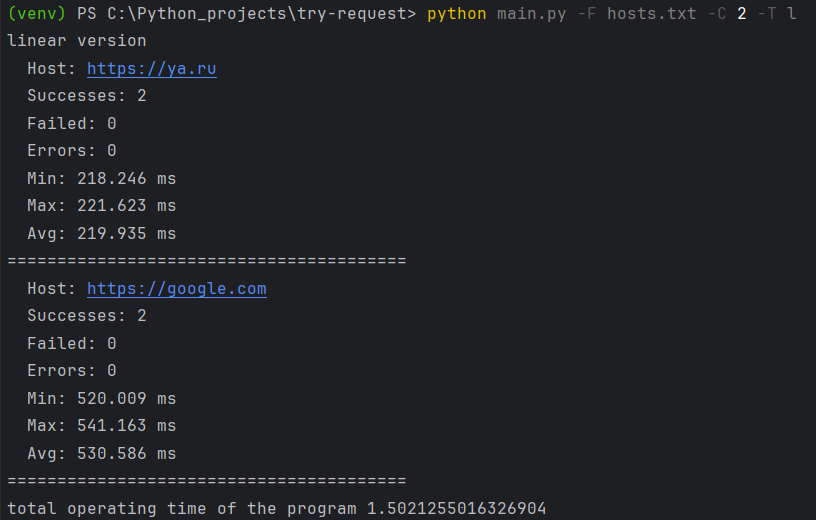
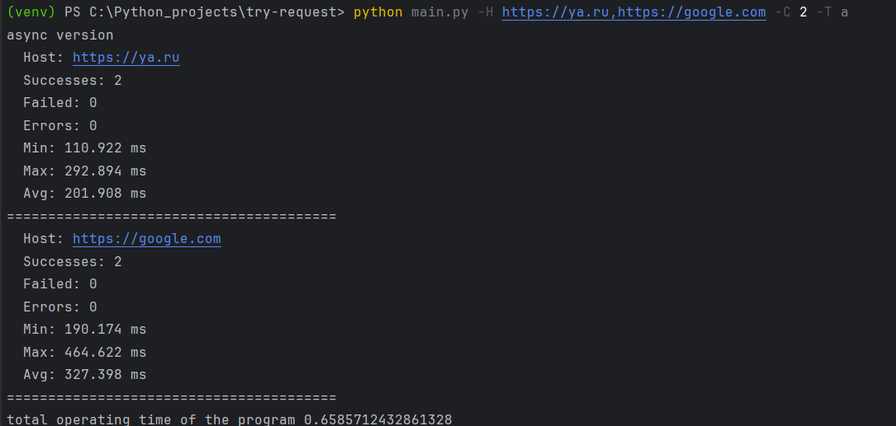

# Тестовое задание для стажера по направлению автотестирование (Python)

## Описание проекта 
Консольная программа тестирования доступности серверов по HTTP протоколу. Программа измеряет время выполнения HTTP-запросов и выводит итоговую статистику по скорости ответа.

### Технологии
- Библиотека **requests** для выполнения HTTP-запросов
- Регулярные выражения для проверки формата адреса
- Модули для реализации параллельного выполнения (**concurrent.futures.ProcessPoolExecutor**)
- Библиотека **aiohttp** для асинхронного выполнения  

### Запуск программы
Установить необходимые зависимости
```
pip install -r requirements.txt
```
Общие параметры запуска:
- -H/--hosts <хосты> - адреса хостов через запятую
- -C/--count <число> - число запросов на сервер
- -O/--output <файл> - путь к файлу для вывода результатов
- -F/--file <файл> - путь к файлу со списком хостов для проверки (например, hosts.txt)

Для запуска программ выполните команду в терминале:
- Последовательная версия:
```
    python main.py -F hosts.txt -C 2
```

- Параллельная версия:
```
    python parallel_main.py -F hosts.txt -C 2
```

- Асинхронная версия:
```
    python async_main.py -F hosts.txt -C 2
```
Эти команды запустят проверку доступности серверов из файла hosts.txt, отправляя по 2 запроса к каждому хосту и выводя статистику по времени ответа и успешности соединений.

#### Примеры работы программ




